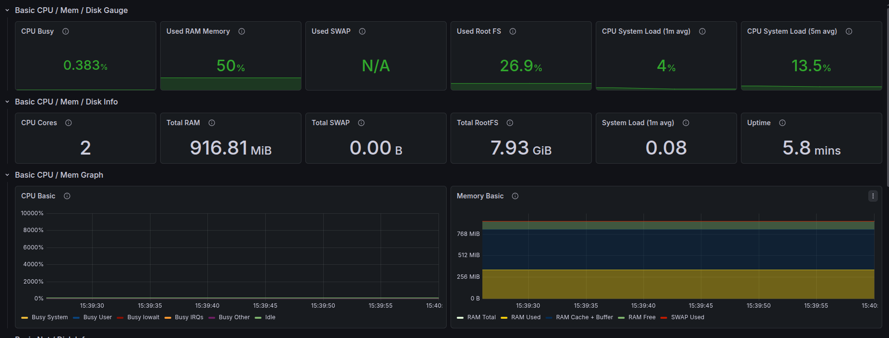
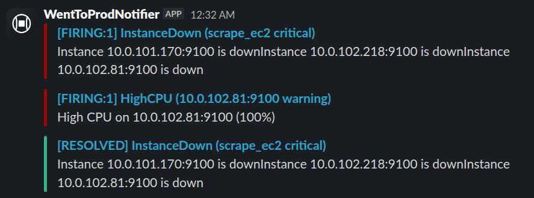
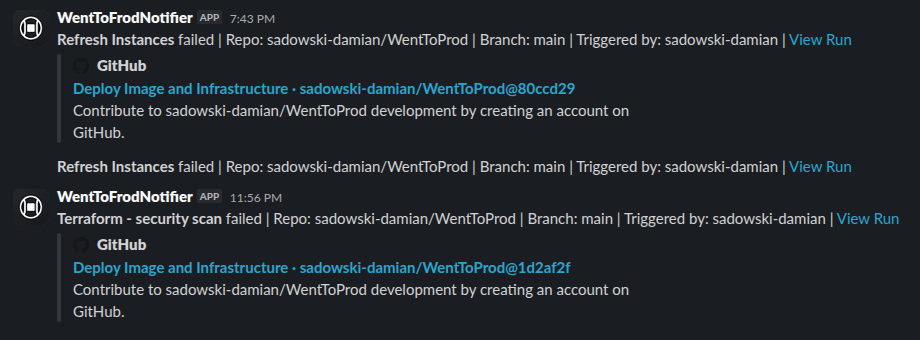

# WentToProd — DevOps na AWS: CI/CD, IaC i Monitoring


> Projekt pokazuje pełny cykl życia aplikacji —
> od commita do działającej aplikacji na AWS.
> Każdy push na `main` uruchamia pipeline:
> budowanie obrazu, skanowanie bezpieczeństwa, provisioning infrastruktury i zero-downtime deployment.
> Historia każdego deployu trafia do bazy danych i jest widoczna na stronie.

---

## Architektura
Infrastruktura jest podzielona na **3 workspaces Terraform HCP**,
co pozwala niszczyć kosztowne zasoby i pozostawiać te, które nie generują kosztów — skracając czas działania pipeline.

| Workspace   | Zawartość                                                                        | Kiedy działa? |
|-------------|----------------------------------------------------------------------------------|---------------|
| **network** | VPC, Subnety, Internet Gateway, Security Groups, Route53, ACM, CloudTrail, GuardDuty | Zawsze    |
| **db**      | RDS PostgreSQL Multi-AZ                                                          | Zawsze        |
| **infra**   | ALB, ASG, EC2, NAT Gateway, WAF, Monitoring                                      | Na żądanie    |

Infrastruktura z workspace `infra` jest **automatycznie niszczona codziennie o 22:30 UTC** — workspace `network` oraz `db` pozostają.
Takie rozwiązanie pozwala zminimalizować koszty, jednocześnie zapewniając szybkie wdrożenie aplikacji.

<p align="center">
  
</p>

---

## Stack technologiczny

| Kategoria      | Technologie                                                                             |
|----------------|-----------------------------------------------------------------------------------------|
| Chmura         | AWS: VPC, EC2, ALB, ASG, RDS, NAT Gateway, SSM, ACM, Route53, WAF, S3, KMS             |
| Bezpieczeństwo | AWS WAF, GuardDuty, CloudTrail, VPC Flow Logs, tfsec, Trivy, SSM SecureString          |
| IaC            | Terraform + HCP Terraform Cloud (3 workspace'y)                                         |
| CI/CD          | GitHub Actions — multi-stage pipeline z manual approvals                                |
| Konteneryzacja | Docker (multi-stage build) + GitHub Container Registry                                  |
| Monitoring     | Prometheus + Grafana + Alertmanager + Node Exporter                                     |

---

## Jak działa pipeline

Każdy push do `main` zmieniający pliki w `/src` uruchamia automatycznie:
1. **Build & Push Image** — obraz Dockera jest budowany → skanowanie obrazu używając Trivy → push obrazu z tagiem SHA commita i `latest` do GHCR.
2. **Terraform - Security Scan** — sprawdzanie infrastruktury Terraforma pod kątem bezpieczeństwa.
3. **Network — Plan** — Terraform plan dla warstwy sieciowej. Jeżeli brak zmian, Apply jest pomijany.
4. **Network — Apply** — oczekuje na zatwierdzenie przez GitHub Environments → Terraform Apply.
5. **Database — Plan / Infra — Plan** — oba plany uruchamiają się równolegle po zakończeniu warstwy Network.
6. **Database — Apply / Infra — Apply** — każda warstwa czeka na osobny Manual Approval w GitHub Environments.
7. **Register Commit into DB** — POST na `/deploys` rejestruje SHA, autora i czas w PostgreSQL.
8. **Instance Refresh** — ASG płynnie wymienia instancje na nowe z najnowszym obrazem (`MinHealthyPercentage=50`), zero downtime.

<p align="center">
  
  <br>
  <sub>Przebieg pipeline w GitHub Actions — od builda przez tfsec, plany i apply każdej warstwy, aż do instance refresh</sub>
</p>

Każdy błąd na dowolnym etapie → powiadomienie na Slack.

---

## Bezpieczeństwo

### Sieć i dostęp
- **Izolacja sieciowa** — EC2 i RDS wyłącznie w prywatnych podsieciach, dostęp z internetu tylko przez ALB
- **AWS WAF** podpięty pod ALB — blokuje OWASP Top 10 (SQL injection, XSS, path traversal) przez AWS Managed Rules + rate limiting 1000 req/5 min
- **TLS** — certyfikat wildcard `*.damiansadowski.cloud` z ACM, HTTP automatycznie przekierowywany na HTTPS
- **IMDSv2** wymuszone na wszystkich EC2 (`http_tokens = required`)

### Dane i sekrety
- **Szyfrowanie** — RDS encrypted at rest, S3 SSE-AES256, SSM SecureString z KMS
- **KMS** — dedykowany klucz dla CloudTrail z automatyczną rotacją (`enable_key_rotation = true`)
- **Least privilege IAM** — osobne role dla EC2 aplikacji i monitoringu.

### Audyt i wykrywanie zagrożeń
- **CloudTrail** — loguje wszystkie wywołania API (multi-region), logi szyfrowane KMS i przechowywane w S3.
- **VPC Flow Logs** — rejestruje cały ruch sieciowy w VPC do CloudWatch Logs (trzyma przez 30 dni)
- **GuardDuty** — Wykrywanie zagrożeń: anomalie w ruchu, podejrzane wywołania API.
- **S3 bucket versioning** — logi CloudTrail i ALB nie mogą zostać nadpisane bez śladu

### CI/CD
- **Trivy** — skanowanie obrazu Docker przed pushem.
- **tfsec** — skanowanie wszystkich 3 workspaces Terraforma przed apply

---

## Monitoring i alerty

Dedykowana instancja monitoringu w prywatnej podsieci uruchamia Prometheus, Grafana i Alertmanager jako kontenery (Docker Compose).

- **Node Exporter** na każdej instancji ASG zbiera metryki systemowe (CPU, RAM, dysk, sieć)
- **Prometheus** używa EC2 Service Discovery — automatycznie wykrywa instancje po tagu `EC2-app-instance-ASG`.
- **Grafana** pokazuje metryki na preinstalowanym dashboardzie Node Exporter Full
- **Alertmanager** wysyła powiadomienia na Slack gdy:
  - instancja przestaje odpowiadać (`InstanceDown` — po 1 minucie)
  - CPU przekracza 80% przez 5 minut (`HighCPU`)
  - wolne miejsce na dysku spada poniżej 20% (`HighDisk`)

**Dostęp do Grafany** (przez SSM port forwarding):
```bash
./scripts/grafana-forward.sh
# Grafana dostępna pod http://localhost:3000
```

### Screenshoty

<p align="center">
  
  <br>
  <sub>Dashboard Node Exporter Full w Grafanie — metryki CPU, RAM, dysk i sieć wszystkich instancji ASG w jednym miejscu</sub>
</p>

<p align="center">
  
  <br>
  <sub>Powiadomienie Slack wysłane przez Alertmanagera — alert InstanceDown po wykryciu niedostępnej instancji</sub>
</p>

<p align="center">
  
  <br>
  <sub>Powiadomienie Slack o błędzie w pipeline — zawiera nazwę joba, branch, autora</sub>
</p>

---

## Zarządzanie kosztami

| Zasób                                                    | Koszt/mies (przybliżony) |
|----------------------------------------------------------|--------------------------|
| RDS Multi-AZ (db.t3.micro)                               | ~$30                     |
| NAT Gateway × 2                                          | ~$64                     |
| EC2 × 3 (t3.micro)                                       | ~$25                     |
| ALB                                                      | ~$16                     |
| S3, Route53, CloudWatch, misc                            | ~$5                      |
| **Łącznie gdy infra działa**                             | **~$140**                |
| **Łącznie gdy infra zniszczona** (tylko RDS + network)   | **~$35**                 |

Warstwa `infra` niszczona codziennie o 22:30 UTC.

---

## Wymagania wstępne

Do uruchomienia projektu potrzebne są:
- Konto AWS
- [Terraform CLI](https://developer.hashicorp.com/terraform/install) + konto [HCP Terraform Cloud](https://app.terraform.io/) z 3 skonfigurowanymi workspace'ami (`wenttoprod-network`, `wenttoprod-db`, `wenttoprod-infra`)
- GitHub Actions skonfigurowane z sekretami: `AWS_ACCESS_KEY_ID`, `AWS_SECRET_ACCESS_KEY`, `TF_API_TOKEN`
- Zarejestrowana domena w Route53 (lub delegowana do Route53)
- Uruchomienie skryptu bootstrap przed pierwszym deployem:
```bash
./scripts/bootstrap-ssm.sh <ghcr-login> <ghcr-password> <api-key> <slack-webhook-url>
```

---
