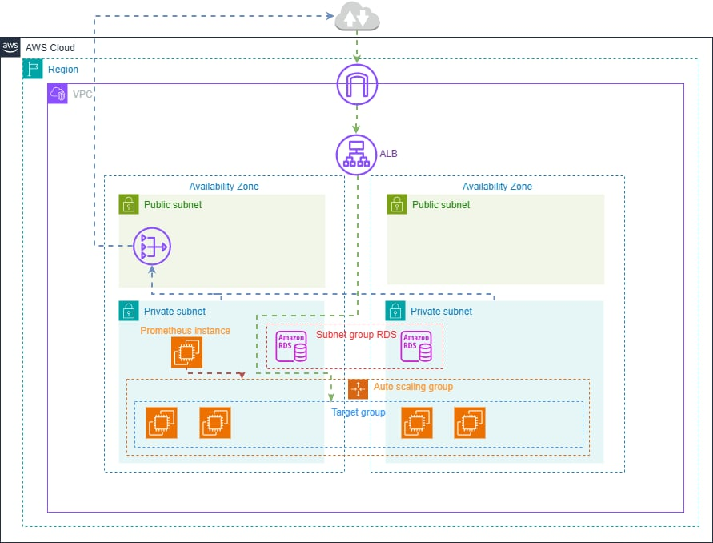

# WentToProd | Prace nad README dalej trwaja

Ten projekt zostal stworzony jako praktyczne wykorzystanie umiejetnosci ktore nabylem podczas nauki do certyfikatow oraz dodatkowo z kursow ktore przerobilem
Glownym celem projektu nie jest sama logika biznesowa i mocne rozbudowanie samej aplikacji, lecz **zbudowanie kompletnego, bezpiecznego oraz skalowalnego srodowiska produkcyjnego** opartego na rynkowych standardach (IaC, Konteneryzacja, Chmura, Monitoring)

## O aplikacji
Aplikacja zostala napisana w .NET 8. Jej zadaniem jest UWAGA PLAN JESZCZE NIE ZAIMPLEMETNOWANE pobieranie historii commitow z tego repo GitHub (autor, data, ID_commita), zapisywanie tych danych w RDS na AWS, a nastepnie wyswietlenie tego na prostej stronie.

## Stack Technologiczny DevOps
* **Chmura**: Amazon Web Services (AWS)
* **Infrastructure as Code (IaC)**: Terraform, HCP Terraform
* **CI/CD**: GitHub Actions
* **Konteneryzacja**: Docker, GitHub Container Registry (GHCR)
* **Monitoring i Obserwowalnosc**: Prometheus, Grafana
* W PLANACH JESZCZE JEST ZEBY Z GITHUB ACTIONS WYSYLAC WIADOMOSCI NA SLACKA (na pozniej)

## Architektura Chmury AWS 
Infrastruktura zostala zaprojektowana z mysla o wysokiej dostepnosci (High Availability) UWAGA JAK NA RAZIE NIE WSZYSTKO JEST HIGH AVAILABILITY (TESTY).

### Kluczowe zalozenia architektoniczne
Projekt podzielony na 3 workspace w celu optymalizacji kosztow tworzenia
* **Sieć (VPC)**: Bedzie opis
* **Load Balancing (ALB)**: Bedzie opis
* **Auto Scaling Group (ASG)**: Bedzie opis
* **Provisioning (User Data)**: Bedzie opis
* **Baza Danych (RDS)**: Bedzie opis
* **Dostęp do Internetu (NAT Gateway)**: Bedzie opis
* **Monitoring (Prometheus & Grafana)**: Bedzie opis

## Pipeline CI/CD (GitHub Actions)
Projekt uzywa GitHub Actions do automatyzacji cyklu zycia oprogramowania:
* **deploy.yaml**: Build and push image -> Terraform plan -> Manual approval -> Terraform apply <plan>
* **destroy.yaml** Destroy Terraform 

# Uruchomienie Lokalnie 
Do napisania

